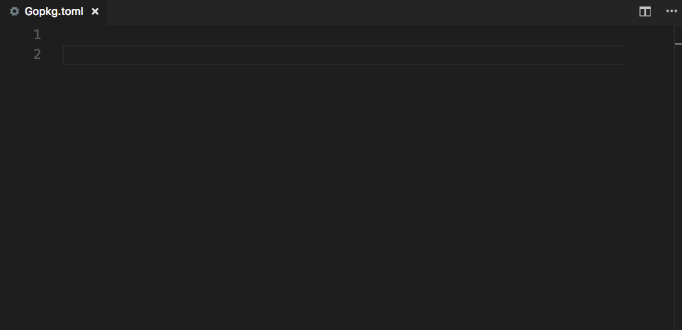

# dep extension for Visual Studio Code

## Features

* Keyword highlighting
* Snippets for
  * `required`
  * `ignored`
  * `constraint`
  * `override`
  * `metadata`, both global and constraint specific
 
## How to use this extension?

Install and open Visual Studio Code. Press `Ctrl+Shift+X` or `Cmd+Shift+X` to open the Extensions pane. Find and install the **dep** extension. You can also install the extension from the [Marketplace](https://marketplace.visualstudio.com/items?itemName=carolynvs.dep). Next open a dep configuration file, `Gopkg.toml` in VS Code to activate the extension.

## Requirements

While not strictly required, installing the [Better TOML](https://marketplace.visualstudio.com/items?itemName=bungcip.better-toml) extension is highly recommended.
